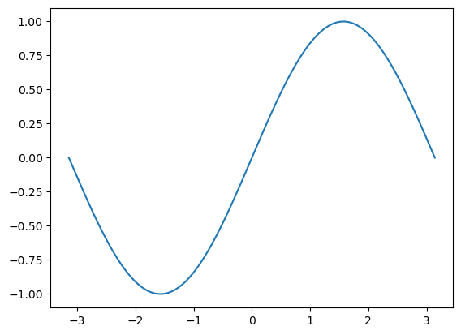

# [Fast AI Course](https://bthek1.github.io/fastAIcourse/)

<!-- WARNING: THIS FILE WAS AUTOGENERATED! DO NOT EDIT! -->

## After changing dependencies

``` sh
pip install fastAIcourse
```

``` sh
pip install -e '.[dev]'
```

## AI Types

- Multi layer preception (MLP)
- Convolution Neural Network (CNN) ex. ResNET, VGG
- Neural Cellular Automata (NCA)

## Structure

1.  Data process
    - Normalise
    - Remove NAN
2.  Create Model
    - try decision tree - random forest
3.  Run model

## Model structure

1.  train/test split
    - asd
2.  initalise random weights
3.  calculate loss
4.  Gradient descent - recalculate weights
5.  Repeat steps 2 - 4

``` python
import torch
import math
import matplotlib.pyplot as plt

dtype = torch.float
device = "cuda" if torch.cuda.is_available() else "cpu"
torch.set_default_device("cuda:0")
device
```

    'cuda'

``` python
# Create Tensors to hold input and outputs.
# By default, requires_grad=False, which indicates that we do not need to
# compute gradients with respect to these Tensors during the backward pass.
x = torch.linspace(-math.pi, math.pi, 2000, dtype=dtype)
y = torch.sin(x)
plt.plot
plt.plot(x.detach().cpu(),y.detach().cpu())
```



``` python
# Create random Tensors for weights. For a third order polynomial, we need
# 4 weights: y = a + b x + c x^2 + d x^3
# Setting requires_grad=True indicates that we want to compute gradients with
# respect to these Tensors during the backward pass.
from torch import tensor

a = tensor([1], dtype=dtype, requires_grad=True)
b = tensor([0], dtype=dtype, requires_grad=True)
c = tensor([0], dtype=dtype, requires_grad=True)
d = tensor([0], dtype=dtype, requires_grad=True)

a,b,c,d
```

    (tensor([1.], device='cuda:0', requires_grad=True),
     tensor([0.], device='cuda:0', requires_grad=True),
     tensor([0.], device='cuda:0', requires_grad=True),
     tensor([0.], device='cuda:0', requires_grad=True))

``` python
torch.abs(loss-a)
```

    tensor([8.3212], device='cuda:0', grad_fn=<AbsBackward0>)

``` python
learning_rate = 1e-6

y_pred = a + b * x + c * x ** 2 + d * x ** 3
plt.plot(x.detach().cpu(),y_pred.detach().cpu())

previous_loss = tensor([0], dtype=dtype, requires_grad=True)

for t in range(2000):
    # Forward pass: compute predicted y using operations on Tensors.
    y_pred = a + b * x + c * x ** 2 + d * x ** 3

    # Compute and print loss using operations on Tensors.
    # Now loss is a Tensor of shape (1,)
    # loss.item() gets the scalar value held in the loss.
    loss = (y_pred - y).pow(2).sum()
    if torch.abs(previous_loss - loss) > 50:
        previous_loss = loss
        print(t, loss.item(), previous_loss.item())
        plt.plot(x.detach().cpu(),y_pred.detach().cpu())
        

    # Use autograd to compute the backward pass. This call will compute the
    # gradient of loss with respect to all Tensors with requires_grad=True.
    # After this call a.grad, b.grad. c.grad and d.grad will be Tensors holding
    # the gradient of the loss with respect to a, b, c, d respectively.
    loss.backward()

    # Manually update weights using gradient descent. Wrap in torch.no_grad()
    # because weights have requires_grad=True, but we don't need to track this
    # in autograd.
    with torch.no_grad():
        a -= learning_rate * a.grad
        b -= learning_rate * b.grad
        c -= learning_rate * c.grad
        d -= learning_rate * d.grad

        # Manually zero the gradients after updating weights
        a.grad = None
        b.grad = None
        c.grad = None
        d.grad = None

print(f'Result: y = {a.item()} + {b.item()} x + {c.item()} x^2 + {d.item()} x^3')
plt.plot(x.detach().cpu(),y.detach().cpu())
```

    0 2999.5 2999.5
    1 2633.0322265625 2633.0322265625
    2 2440.7451171875 2440.7451171875
    3 2299.944091796875 2299.944091796875
    4 2184.31591796875 2184.31591796875
    5 2086.458740234375 2086.458740234375
    6 2002.959228515625 2002.959228515625
    7 1931.475830078125 1931.475830078125
    8 1870.134033203125 1870.134033203125
    9 1817.367919921875 1817.367919921875
    11 1732.486328125 1732.486328125
    13 1668.533203125 1668.533203125
    16 1599.33935546875 1599.33935546875
    20 1537.807861328125 1537.807861328125
    25 1486.8544921875 1486.8544921875
    32 1436.569580078125 1436.569580078125
    41 1384.7811279296875 1384.7811279296875
    51 1332.85009765625 1332.85009765625
    62 1278.809814453125 1278.809814453125
    73 1227.13720703125 1227.13720703125
    85 1173.205322265625 1173.205322265625
    97 1121.6829833984375 1121.6829833984375
    110 1068.4569091796875 1068.4569091796875
    123 1017.7958984375 1017.7958984375
    137 965.9642333984375 965.9642333984375
    152 913.40380859375 913.40380859375
    168 860.5406494140625 860.5406494140625
    185 807.7796020507812 807.7796020507812
    203 755.4998779296875 755.4998779296875
    222 704.0501098632812 704.0501098632812
    242 653.7462768554688 653.7462768554688
    264 602.63671875 602.63671875
    288 551.522705078125 551.522705078125
    314 501.137939453125 501.137939453125
    343 450.4776306152344 450.4776306152344
    376 399.1850280761719 399.1850280761719
    413 348.7738037109375 348.7738037109375
    456 298.3631896972656 298.3631896972656
    507 248.23623657226562 248.23623657226562
    570 198.20193481445312 198.20193481445312
    653 147.97088623046875 147.97088623046875
    774 97.72457885742188 97.72457885742188
    999 47.624717712402344 47.624717712402344
    Result: y = 0.03058280050754547 + 0.8431105613708496 x + -0.005276043433696032 x^2 + -0.09139160066843033 x^3


